# ESIEE-IT - 2022 - Apprentissage de React

> 🚨 **Projet déplacer ici ▶▶ : [https://github.com/2023-esiee-projectlab/esiee-it_2022_react_learn](https://github.com/2023-esiee-projectlab/esiee-it_2022_react_learn)**

## Docs.

[Documentation](https://fr.reactjs.org/docs/)

## Commit v0.0.1 - Component

## Commit v0.0.2 - Functions

## Commit v0.0.3 - CSS

## Commit v0.0.4 - Images

## Commit v0.0.5 - Appel

## Commit v0.0.6 - Datas

## Commit v0.0.7 - Conditions

Résultat

Plus

## Commit v0.0.8 - Appel d'un composant dans un autre

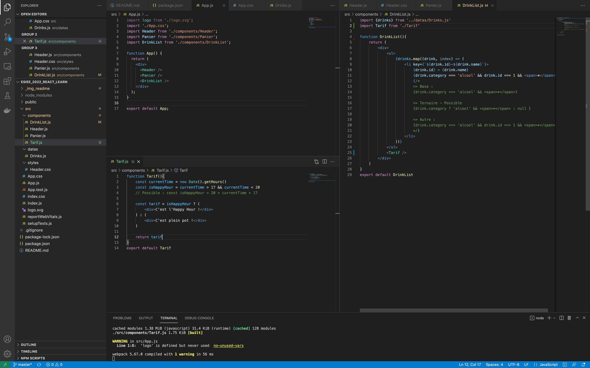

## Commit v0.0.9 - Passage d'argument à un composant

détail de la destructuration avec `props`

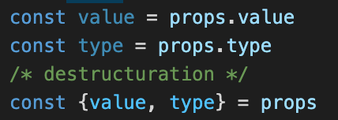

code 

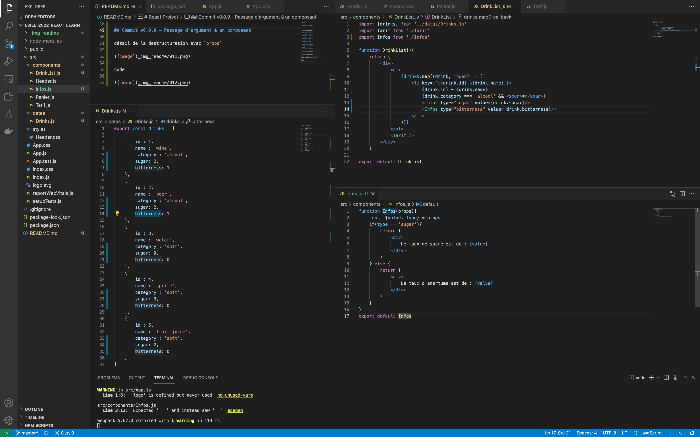

## Commit v0.0.10 - Évènements

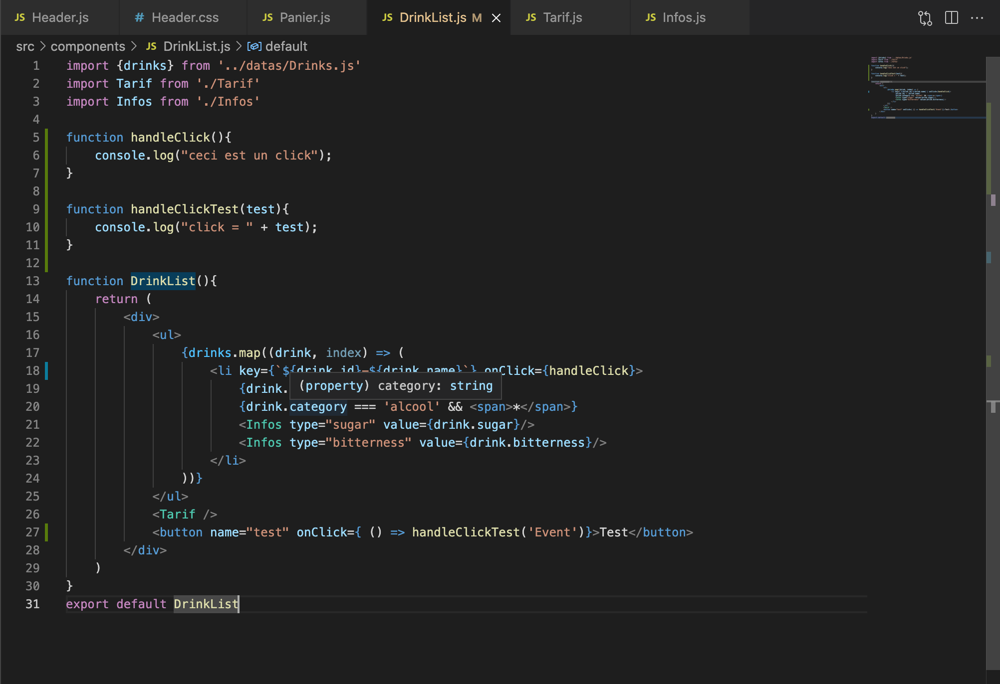

## Commit v0.0.11 - Formulaires

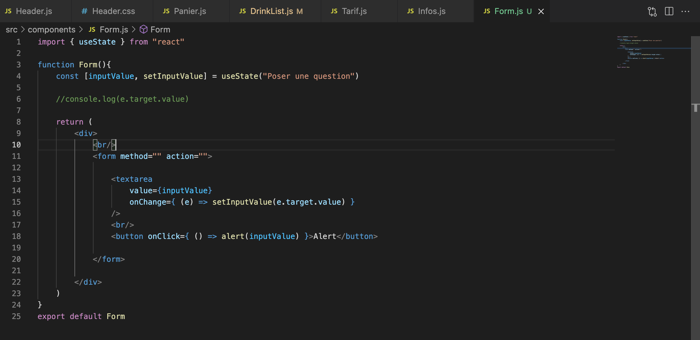

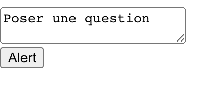

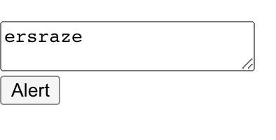

## Commit v0.0.12 - Hook - useState

Exemple avec la lettre "f"

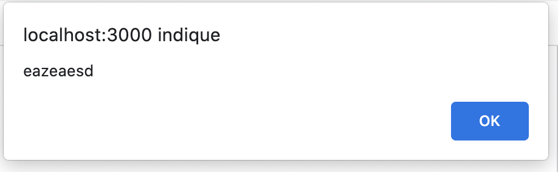

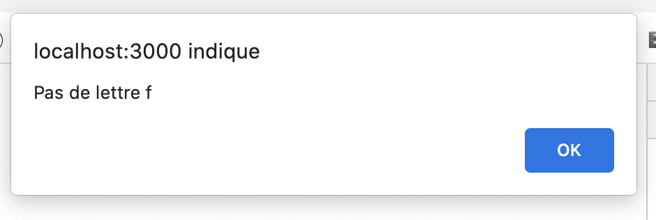

### Autres

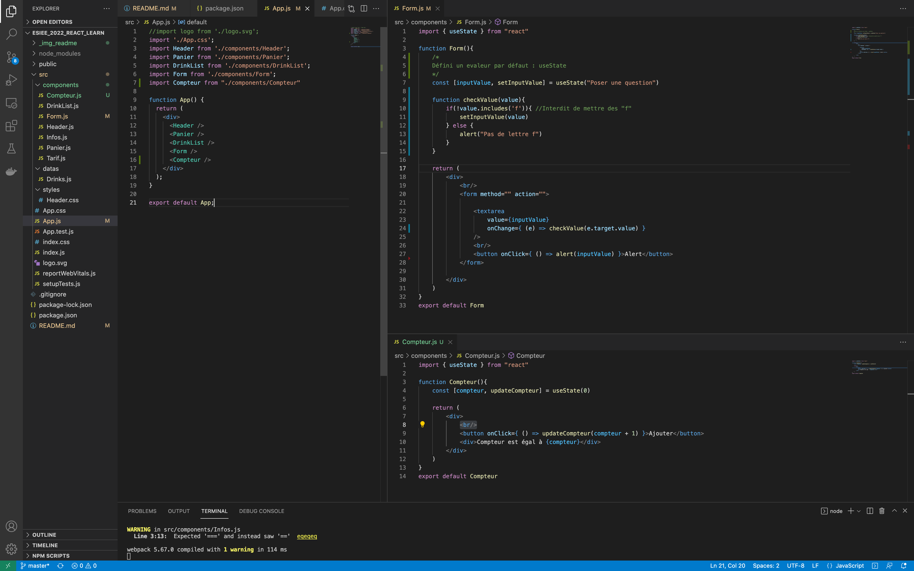

## Commit v0.0.13 - Hook - useState ++

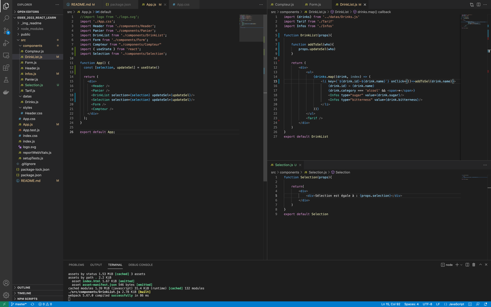

## Commit v0.0.13 - Hook - useEffect

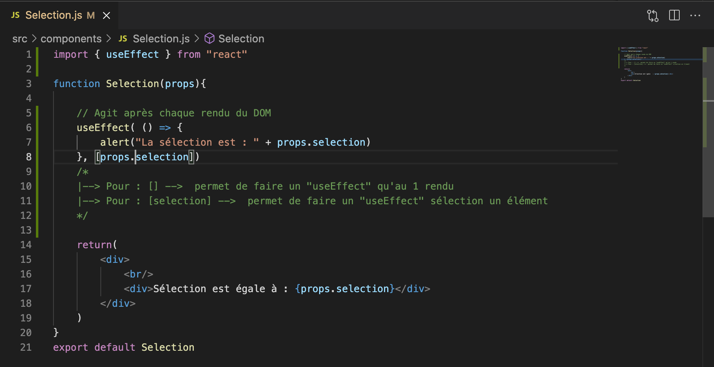
