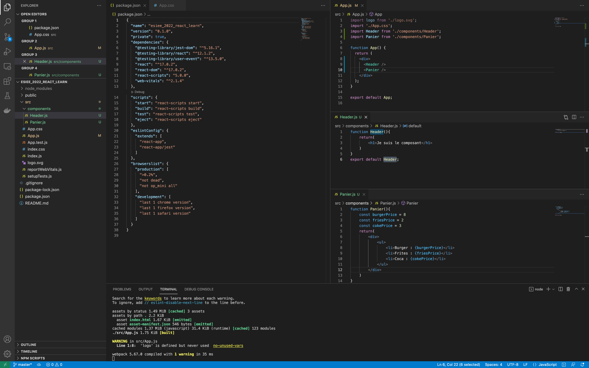
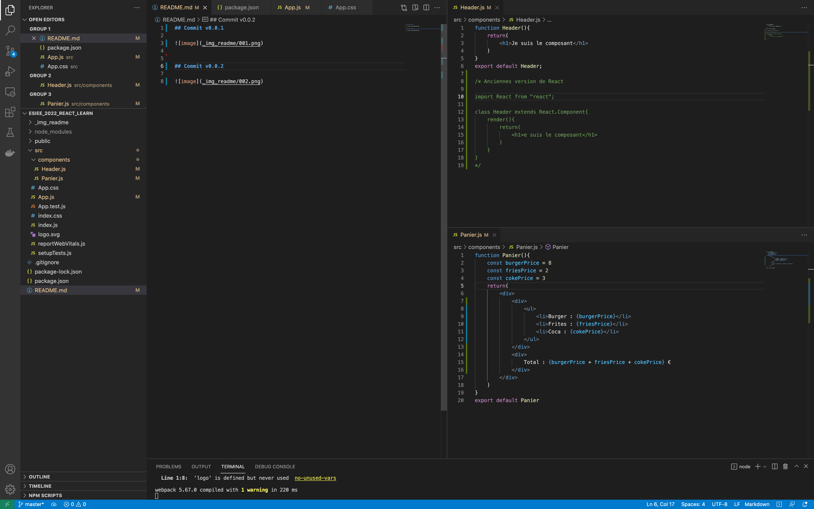
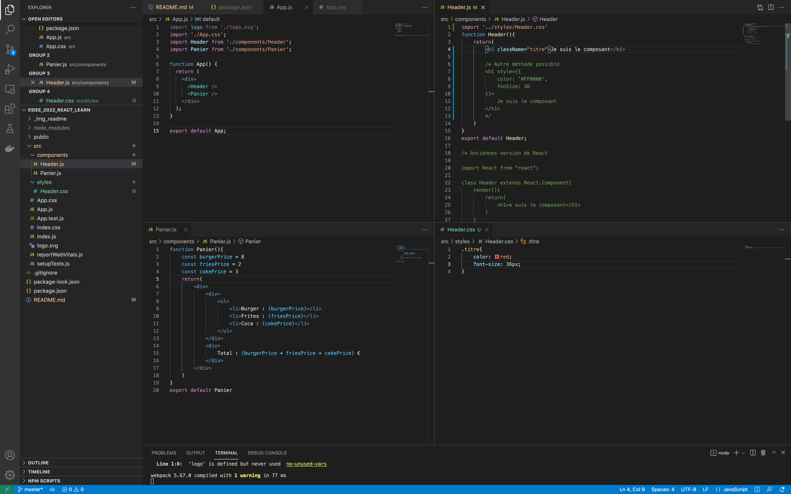
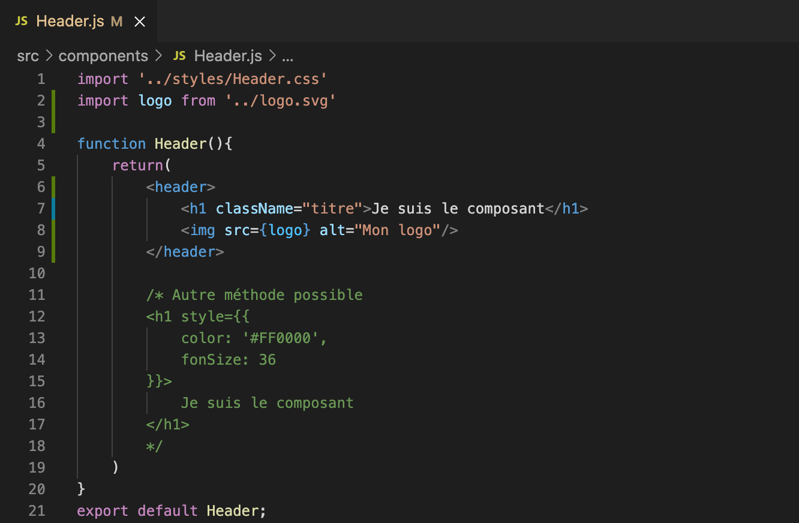
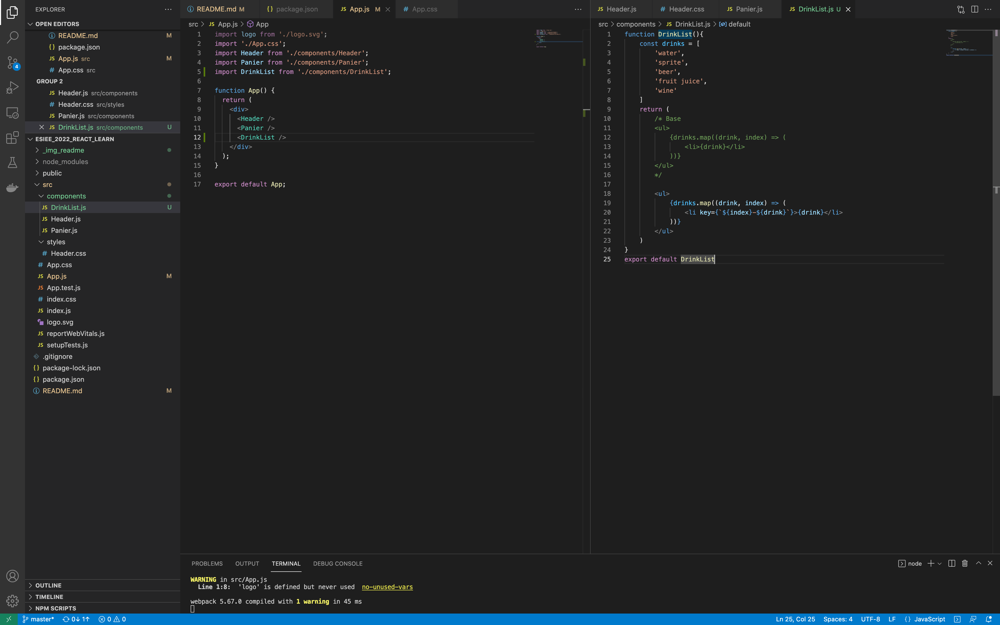
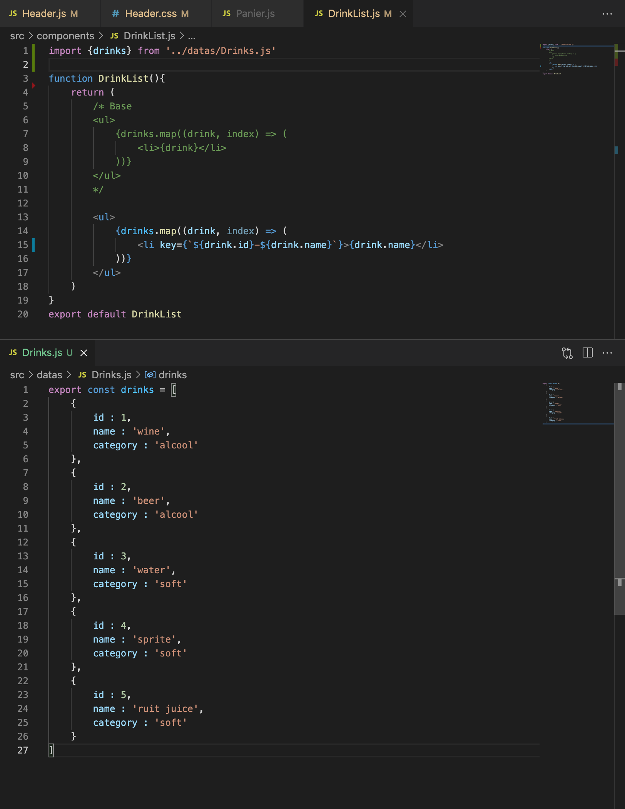
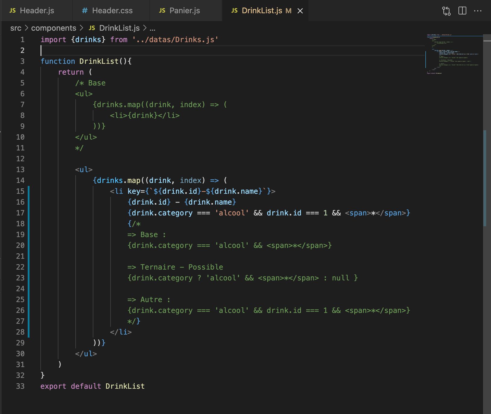
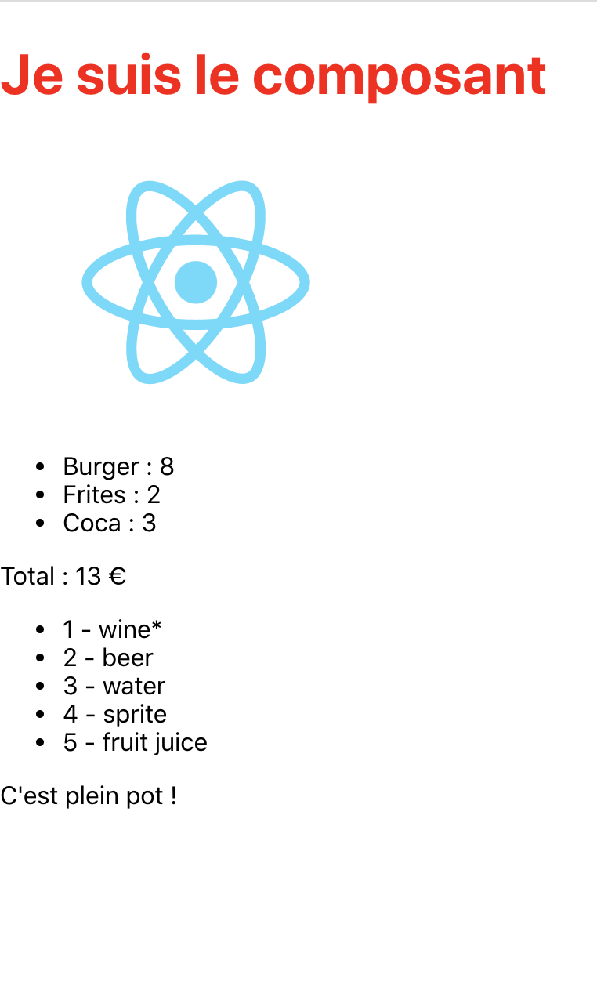
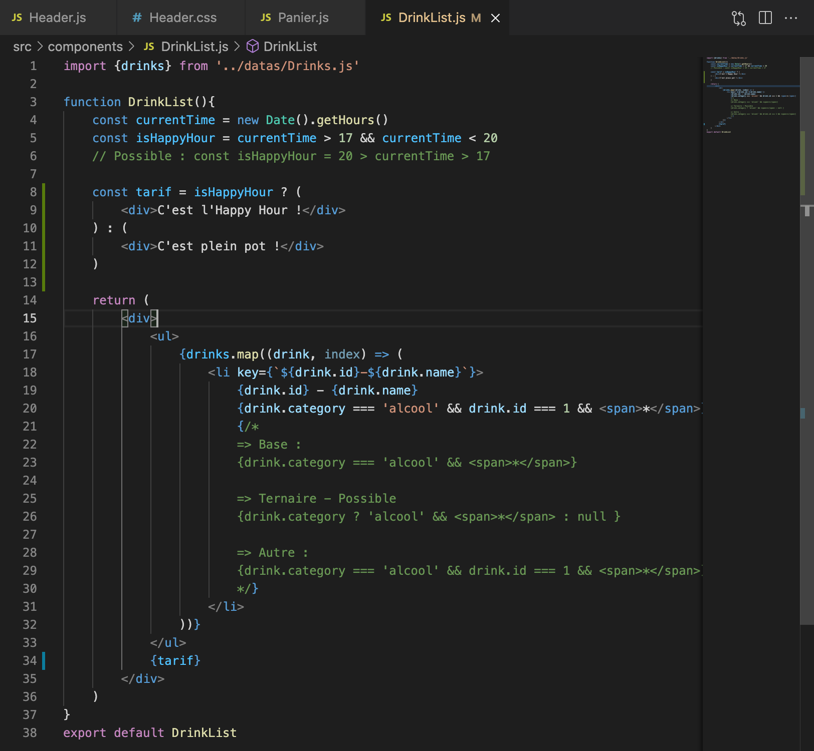

# React Project

## Docs.

[Documentation](https://fr.reactjs.org/docs/)

## Commit v0.0.1 - Component

## Commit v0.0.2 - Functions

## Commit v0.0.3 - CSS

## Commit v0.0.4 - Images

## Commit v0.0.5 - Appel

## Commit v0.0.6 - Datas

## Commit v0.0.7 - Conditions

Résultat

Plus

